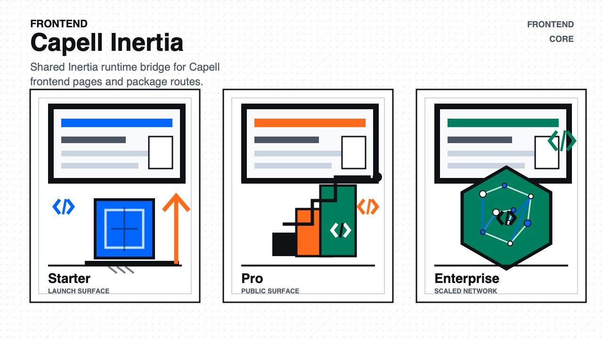

# Capell Inertia

<!-- prettier-ignore-start -->

## What This Plugin Adds

Capell Inertia is an **Available**, **No schema impact** Capell plugin in the **Capell Frontend** product group. It ships as `capell-app/inertia` and extends these surfaces: frontend.

Shared Inertia runtime bridge for Capell public pages, package-owned frontend routes, and adapter-driven themes, with sanitized adapter, root-view, and component configuration.

After install, the package affects public rendering, public routes, or frontend runtime behaviour.

Status details:

- Status: Available
- Tier: core
- Bundle: frontend
- Composer package: `capell-app/inertia`
- Namespace: `Capell\Inertia`
- Theme key: not applicable

## Why It Matters

**For developers:** The package gives developers package-owned service providers, Actions, Data objects, and Blade views instead of pushing this behaviour into core or application code.

**For teams:** Connect Capell public rendering to Inertia adapters with one root view, middleware stack, safe runtime props, and an adapter registry for package-owned Vue or React frontends.

## Screens And Workflow

Marketplace media is declared in `capell.json`:

- Beta artwork for the headless Inertia bridge; rendered proof belongs to an installed adapter and consuming theme.

## Technical Shape

- Service providers: `Capell\Inertia\Providers\InertiaServiceProvider`.
- Config files: `packages/inertia/config/capell-inertia.php`.
- Actions: `BuildInertiaPagePropsAction`, `RenderInertiaResponseAction`, `ResolveInertiaAdapterKeyAction`, `ResolveInertiaComponentNameAction`, `ResolveInertiaRootViewAction`.
- Data objects: `InertiaAdapterData`.
- Health checks: `Capell\Inertia\Health\InertiaHealthCheck`.
- Blade views: `packages/inertia/resources/views/app.blade.php`.
- Cache tags: `inertia`.

## Data Model

This package has no schema impact. It does not declare package-owned migrations or required tables.

Docs gap: document extension points here if the package delegates persistence to a host package.

## Install Impact

- Admin navigation: no admin surface declared.
- Permissions: none declared in `capell.json`.
- Public routes: none detected in package route files.
- Database changes: no package migrations declared.
- Settings: no package settings declared.
- Queues or schedules: none detected in standard package paths.
- Cache tags: `inertia`.
- Commands: none declared.

## Common Pitfalls

- Keep public Blade and cached HTML free of authoring markers, model IDs, permissions, signed editor URLs, and lazy database queries.
- Keep `composer.json`, `composer.local.json`, `capell.json`, docs, screenshots, and tests aligned when the package surface changes.

## Troubleshooting

| Symptom | Likely cause | Check | Fix |
| --- | --- | --- | --- |
| Package surface is missing after install | Provider or manifest is not loaded | Confirm `capell.json`, package `composer.json`, and provider registration | Reinstall the package, refresh Composer autoload, and clear host caches |
| Public output leaks unexpected state | Render data, cache variation, or authoring boundary has regressed | Check public Blade, cache tags, and public-output safety tests | Move data loading out of Blade and rerun the package public-output tests |

## Quick Start

1. Install the package: `composer require capell-app/inertia`.
2. Run the required setup: no package migrations are declared; clear cached config and routes if the host app uses caches.
3. Verify the package provider is registered and the related frontend, command, or extension point is active.

## Next Steps

- [Package docs](docs/README.md)
- [Overview](docs/overview.md)
- [Screenshot contract](docs/screenshots.json)
- [Marketplace assets](docs/assets/marketplace/)
- [Capell content language plan](../../docs/CONTENT_LANGUAGE_PLAN.md)
- [Capell documentation design system](../../docs/DESIGN_SYSTEM.md)
- [Capell and package ERD notes](../../docs/erd/capell-and-package-erds.md)
- Related packages: [Api](../api/README.md), [Layout Builder](../layout-builder/README.md).
- Focused tests: `vendor/bin/pest packages/inertia/tests --configuration=phpunit.xml`.

<!-- prettier-ignore-end -->
