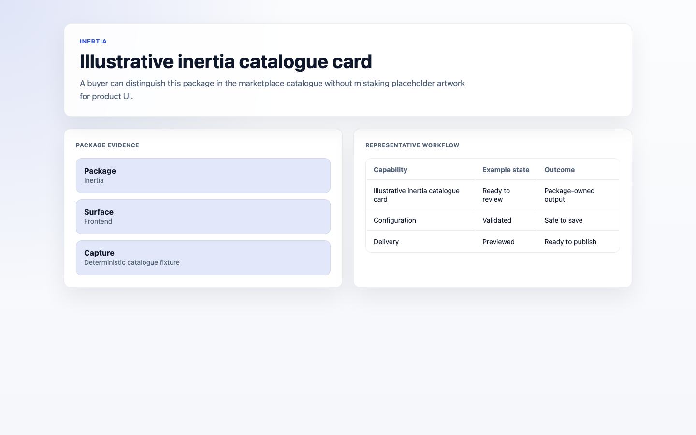

# Capell Inertia

<!-- prettier-ignore-start -->

## What This Plugin Adds

Capell Inertia is an **Available**, **No schema impact** Capell plugin in the **Capell Frontend** product group. It ships as `capell-app/inertia` and extends these surfaces: frontend.

Capell Inertia connects public page resolution to Inertia responses through a registered client adapter.

It adds no admin screen. When an Inertia theme is active, public pages use the configured root view, component name, and adapter.

Evidence: [`src/Providers/InertiaServiceProvider.php`](src/Providers/InertiaServiceProvider.php), [`src/Rendering/CapellInertiaResponseRenderer.php`](src/Rendering/CapellInertiaResponseRenderer.php), [`tests/Feature/InertiaBridgeTest.php`](tests/Feature/InertiaBridgeTest.php), [`src/Actions/ResolveInertiaRootViewAction.php`](src/Actions/ResolveInertiaRootViewAction.php), [`src/Actions/ResolveInertiaComponentNameAction.php`](src/Actions/ResolveInertiaComponentNameAction.php), [`src/Actions/ResolveInertiaAdapterKeyAction.php`](src/Actions/ResolveInertiaAdapterKeyAction.php).

Status details:

- Status: Available
- Tier: core
- Bundle: frontend
- Composer package: `capell-app/inertia`
- Namespace: `Capell\Inertia`
- Theme key: not applicable

## Why It Matters

**For developers:** The adapter registry and typed Actions centralize page props, component resolution, and response rendering for Inertia themes.

**For teams:** Teams can use React or Vue Inertia themes while keeping the normal Capell content workflow.

Evidence: [`src/Support/InertiaAdapterRegistry.php`](src/Support/InertiaAdapterRegistry.php), [`src/Actions/BuildInertiaPagePropsAction.php`](src/Actions/BuildInertiaPagePropsAction.php), [`src/Actions/RenderInertiaResponseAction.php`](src/Actions/RenderInertiaResponseAction.php), [`tests/Unit/InertiaActionTest.php`](tests/Unit/InertiaActionTest.php), [`docs/overview.admin.md`](docs/overview.admin.md), [`src/Support/CapellInertiaManager.php`](src/Support/CapellInertiaManager.php), [`tests/Feature/InertiaBridgeTest.php`](tests/Feature/InertiaBridgeTest.php).

## Screens And Workflow

Screenshot contract: `docs/screenshots.json`.

- Illustrative inertia catalogue card (frontend, required evidence).

## Technical Shape

### Service providers

- `Capell\Inertia\Providers\InertiaServiceProvider`

### Config files

- `packages/inertia/config/capell-inertia.php`

### Actions

- `BuildInertiaPagePropsAction`
- `RenderInertiaResponseAction`
- `ResolveInertiaAdapterKeyAction`
- `ResolveInertiaComponentNameAction`
- `ResolveInertiaRootViewAction`

### Data objects

- `InertiaAdapterData`

### Health checks

- `Capell\Inertia\Health\InertiaHealthCheck`

### Blade views

- `packages/inertia/resources/views/app.blade.php`

### Cache tags

- `inertia`

## Data Model

This package has no schema impact. It registers runtime behaviour through `Capell\Inertia\Providers\InertiaServiceProvider` while persistence remains with Capell core or required packages.

## Install Impact

- Required packages: `capell-app/core`, `capell-app/frontend`, `capell-app/api`.
- Admin navigation: no admin page or resource contribution is declared.
- Admin/editor extensions: none declared.
- Permissions: no package permission declarations or Shield gates detected; host access rules still apply.
- Public routes: none declared.
- Database changes: no package migrations declared.
- Config: `config/capell-inertia.php`.
- Settings: no package settings declared.
- Queues or schedules: none declared.
- Cache tags: `inertia`.
- Commands: none declared.

## Common Pitfalls

- Keep required Capell packages on compatible v4 releases: `capell-app/core`, `capell-app/frontend`, `capell-app/api`.
- Review package configuration before production-like verification: `config/capell-inertia.php`.
- Keep public Blade and cached HTML free of authoring markers, model IDs, permissions, signed editor URLs, and lazy database queries.
- Custom write integrations must preserve invalidation for `inertia` cache tags.

## Troubleshooting

| Symptom | Likely cause | Check | Fix |
| --- | --- | --- | --- |
| Package surface is missing after install | Provider or manifest is not loaded | Confirm `capell.json`, package `composer.json`, and provider registration | Reinstall the package, refresh Composer autoload, and clear host caches |
| Public output leaks unexpected state | Render data, cache variation, or authoring boundary has regressed | Check public Blade, cache tags, and public-output safety tests | Move data loading out of Blade and rerun the package public-output tests |

## Quick Start

1. Install the package: `composer require capell-app/inertia`.
2. Open `/screenshot-fixtures/catalogue/inertia/inertia-catalogue-preview` and confirm the public output renders without admin state.

## Next Steps

- [Package docs](docs/README.md)
- [Overview](docs/overview.md)
- Configuration files: [`config/capell-inertia.php`](config/capell-inertia.php).
- [Troubleshooting](#troubleshooting)
- [Screenshot contract](docs/screenshots.json)
- [Marketplace assets](docs/assets/marketplace/)
- [Capell content language plan](../../docs/CONTENT_LANGUAGE_PLAN.md)
- [Capell documentation design system](../../docs/DESIGN_SYSTEM.md)
- [Capell and package ERD notes](../../docs/erd/capell-and-package-erds.md)
- Related packages: [Api](../api/README.md), [Layout Builder](../layout-builder/README.md).
- Focused tests: `vendor/bin/pest packages/inertia/tests --configuration=phpunit.xml`.

<!-- prettier-ignore-end -->
